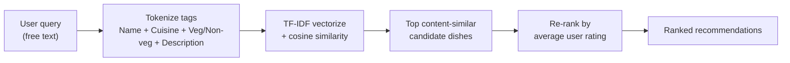

# Food Recommendation System

> "What should I eat?" — the eternal question that has ended friendships, delayed dinners, and crashed entire group chats. So I built a chatbot to answer it. You're welcome, humanity.

A hybrid food recommender that reads your craving in plain English, finds dishes that *taste* similar (content-based), then lets the crowd settle the tie (collaborative). It runs as an interactive console chatbot — type `chicken`, get a ranked plate of suggestions. No login, no cookies, no judgment.

[-2E7D32?style=for-the-badge&logo=googlescholar&logoColor=white)](https://jati.sites.apiit.edu.my/)
[](https://jati.sites.apiit.edu.my/)
[](https://linkedin.com/in/abdullahmhazeq)

> [!NOTE]
> **Peer-reviewed and published.** This isn't a weekend toy — it appeared in **JATI Journal, Vol. 8, No. 2 (2024)** (e-ISSN 2600-7304) with me as sole first author. The README gets to brag a little; the code stays honest.

---

## Results

The headline numbers, no rounding-in-my-favor shenanigans:

| Metric | Result |
| --- | --- |
| Evaluation success rate | **~75%** |
| Approach | Hybrid — **TF-IDF content similarity + rating-based re-ranking** |
| Problem directly tackled | **Cold start** (new users still get recommendations) |
| Publication | **JATI Journal, Vol. 8, No. 2 (2024)**, e-ISSN 2600-7304 |
| Authorship | **Sole first author** |

**Why the cold-start bit matters:** classic collaborative filtering falls apart for a brand-new user with zero ratings — there's nothing to collaborate on. This system leans on content similarity first, so a stranger who's never rated a single dish still walks away with sensible suggestions. The ratings just sharpen the ranking once they exist.

## Tech Stack


## Architecture

The hybrid flow in one breath: **your query** is matched against food tags via **TF-IDF + cosine similarity**, the top content matches are then **re-ranked by average user rating**, and the final shortlist lands in your terminal.



In words, for the mermaid-averse:

```
query ──▶ TF-IDF match ──▶ rating re-rank ──▶ recommendations
        (what it's like)   (what people loved)   (your plate)
```

Step by step:

1. **Tag building** — each dish's `Name`, `C_Type` (cuisine), `Veg_Non`, and `Describe` fields are tokenized with NLTK, lowercased, and fused into one searchable "Tags" string.
2. **Content model** — `TfidfVectorizer` turns those tags into vectors; **cosine similarity** measures how close any two dishes really are.
3. **Collaborative re-rank** — the content shortlist is sorted by **average user rating** from `ratings.csv`, so the crowd's favorites float to the top.
4. **Chatbot loop** — a console interface takes free-text queries (it even says hi back), returns the ranked list, and exits on `exit`.

## Dataset Schema

Two CSVs ship with the repo. Small, tidy, and refreshingly free of mystery columns.

**`food.csv`** — the menu and its metadata

| Column | Type | Description |
| --- | --- | --- |
| `Food_ID` | int | Unique dish identifier (joins to ratings) |
| `Name` | string | Dish name, e.g. *summer squash salad* |
| `C_Type` | string | Cuisine / category, e.g. *Healthy Food*, *Snack* |
| `Veg_Non` | string | Dietary flag — `veg` or `non-veg` |
| `Describe` | string | Ingredient list / description used for similarity |

**`ratings.csv`** — the collaborative signal

| Column | Type | Description |
| --- | --- | --- |
| `User_ID` | int | Identifier of the rating user |
| `Food_ID` | int | Dish being rated (joins to `food.csv`) |
| `Rating` | int | User's score for the dish (1–10 scale) |

## How to Run

```bash
git clone https://github.com/KiritoH4Z3/Food-Recommendation-System-Project.git
cd Food-Recommendation-System-Project
pip install numpy pandas scikit-learn nltk
```

Grab the NLTK tokenizer data once (the chatbot is hungry for `punkt`):

```python
import nltk
nltk.download("punkt")
```

> [!IMPORTANT]
> **One small, very human caveat.** The script's `main()` still has my old `food.csv` / `ratings.csv` paths hardcoded — pointing lovingly at a `C:\Users\silen\OneDrive\Desktop\YEAR 2\AI\` folder that exists only on a laptop I had during my second year. Before you run it, swap `food_file_path` and `ratings_file_path` to wherever your copies live (the repo includes both). Yes, I know. Config files are a virtue. This is documentation, not a confession — the code is staying as-is for now.

Then start the chatbot:

```bash
python "Food Recommendation System Using Hybrid Filtering.py"
```

### Example session

```text
User: hi
Chatbot: Hello! What type of food would you like today?

User: chicken
Recommendation Ranking Results:
Here is a list of dishes with chicken, sorted by average rating:
1. chicken minced salad
2. grilled chicken with quinoa
3. chicken tikka
...
Chatbot: Recommendation generated.

User: exit
Chatbot: Goodbye!
```

(Exact dishes depend on your data, but the vibe — match the craving, rank by what people loved — is always the same.)

## About / Author

**Abdullah Mohammed Hazeq** — Computer Science (AI) graduate, Asia Pacific University, based in Dubai, UAE. I build AI automation, data analysis, and AI implementation projects — ideally ones that solve a real problem and occasionally make you smile. This one started as a research question about the cold-start problem and ended up peer-reviewed, which is a nicer ending than most of my "what should I eat" debates.

[](https://linkedin.com/in/abdullahmhazeq)
[](https://github.com/KiritoH4Z3)
[](mailto:ahazeq.mena@gmail.com)
